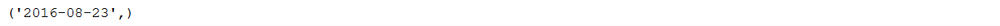
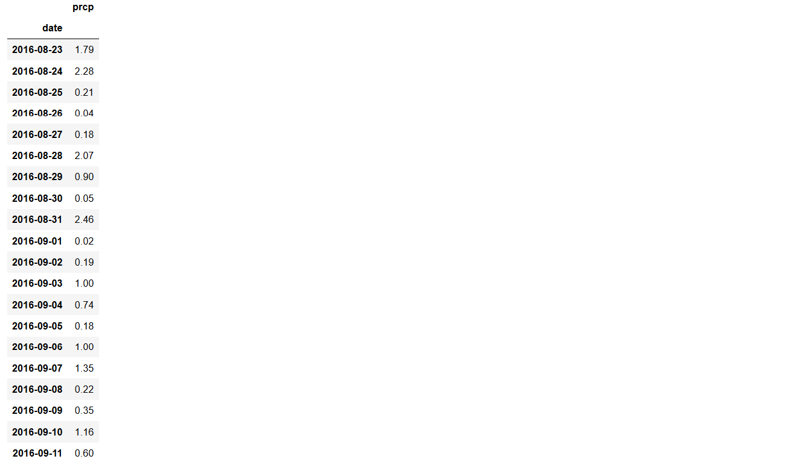
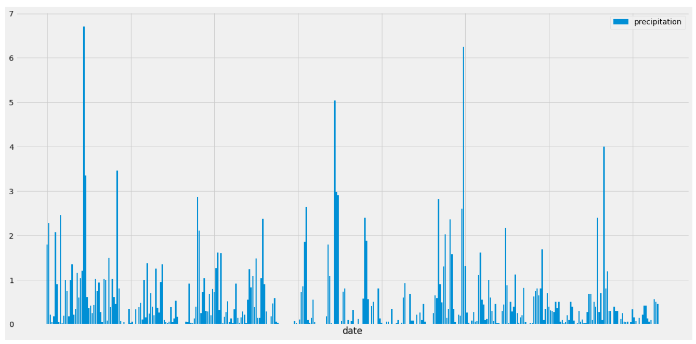
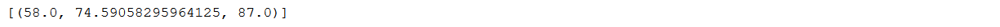
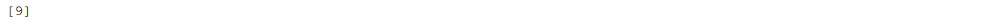
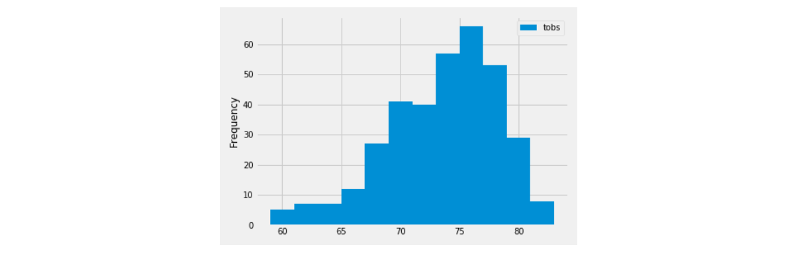
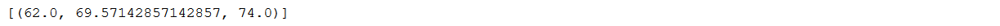
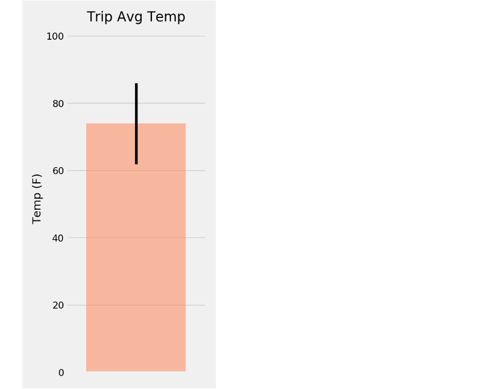
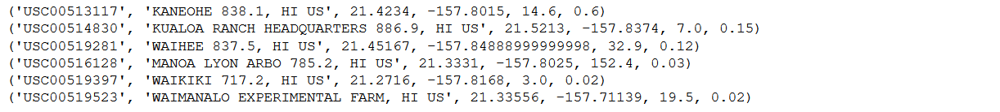

# Hawaiian Vacation

A trip to Hawaii is being planned and the task is to obtain the data and run some analytics to get some of the statistics related to the rainfall over the last year. The task was completed using SQLite as a database and Alchemy as the ORM to query the SQLite database. From here we created a couple of graphs using Pandas and Matplotlib. We have a Data Frame that depicts the general statistics, 2 bar graphs and a histogram. There is also a CSV in which we printed the results obtained from a query. The statistics that we obtained are outlined below.

## Get Date 1 Year Before Last Data Point in Database

## Get All Precipitation Data Over The Year Starting From Last Data Point in Database (In CSV)

## Data Frame Containing Data Over The Year Starting From Last Data Point in Database (Head Of First 20)

## Maximum Precipitation Data For Each Day Over The Year Starting From Last Data Point in Database (Head Of First 20)

## Bar Chart Outlining The Highest Precipitation Over The Year Starting From Last Data Point In Database

## Precipitation Summary Statistics Spanning Entire Data Set Minus Precipitation With No Values

## Number Of All Weather Stations in Database

## Most Active Stations In Descending Order

## Statistics Of Most Active Station

## Most Active Station With Temperature Observations Data Frame

## Histogram Of Most Active Station With Temperature Observations Data Frame

## Calculate Temperatures Function Example

## Calculate Temperatures Function Using 1 Year Before Vacation (Custom Time Frame In Which We Plan The Vacation)

## Bar Chart For Trip Average Temperature With Error Bar

## Weather Station Information Using 1 year Before Vacation (Custom Time Frame In Which We Plan The Vacation)

